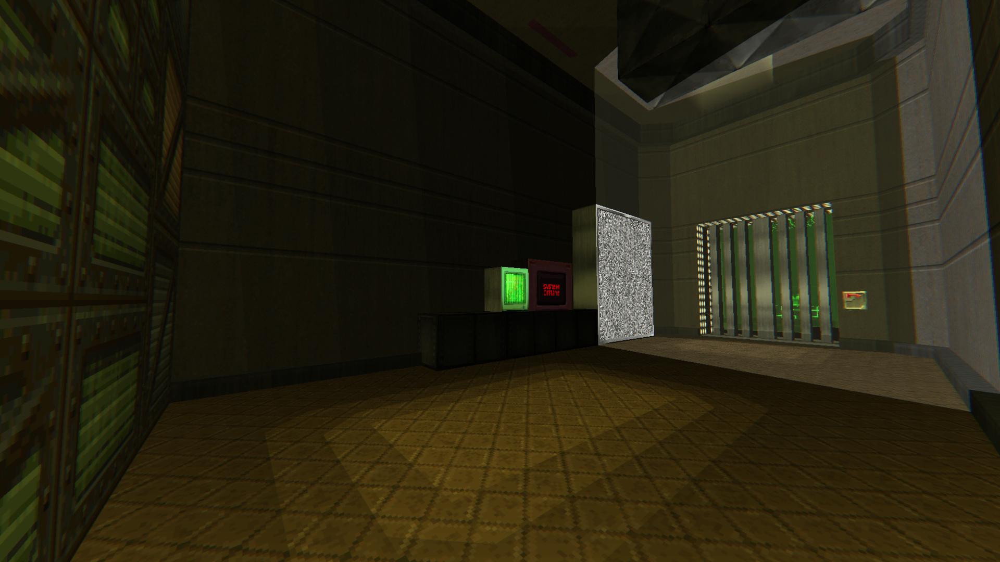
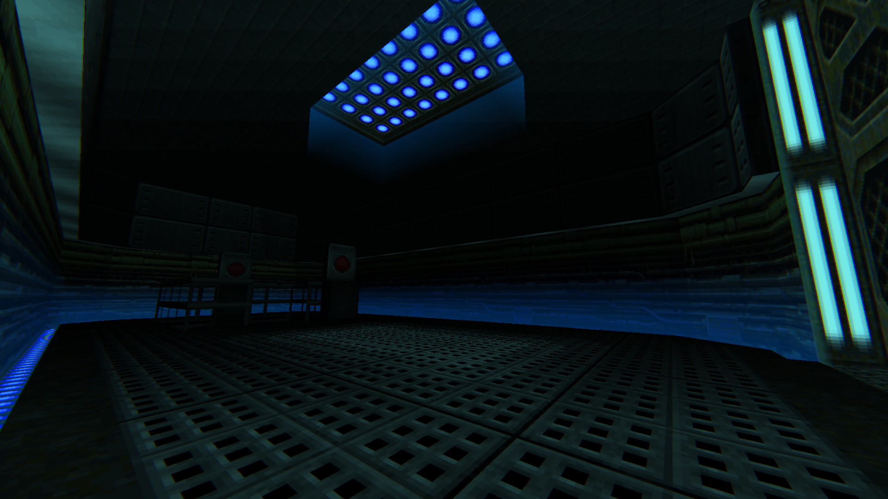
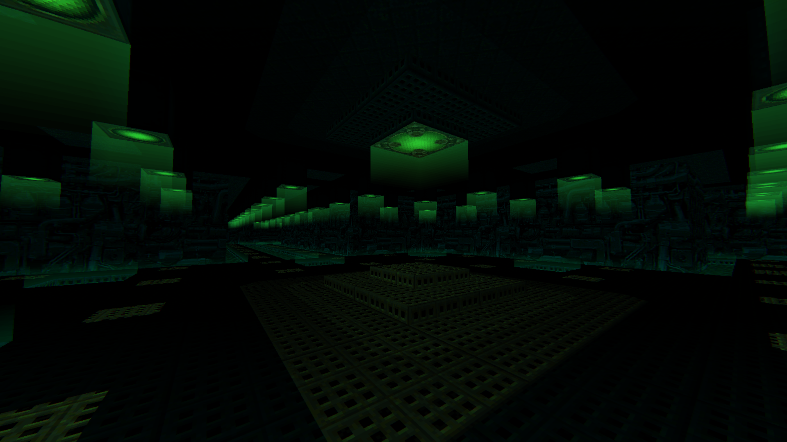
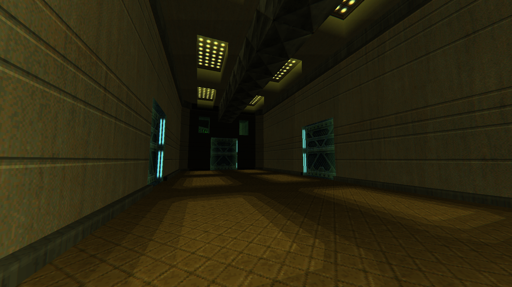
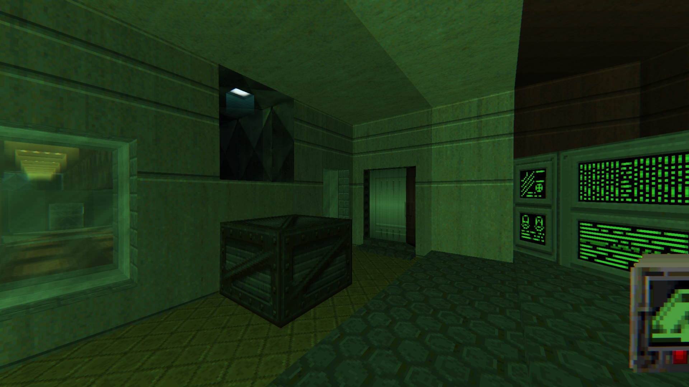
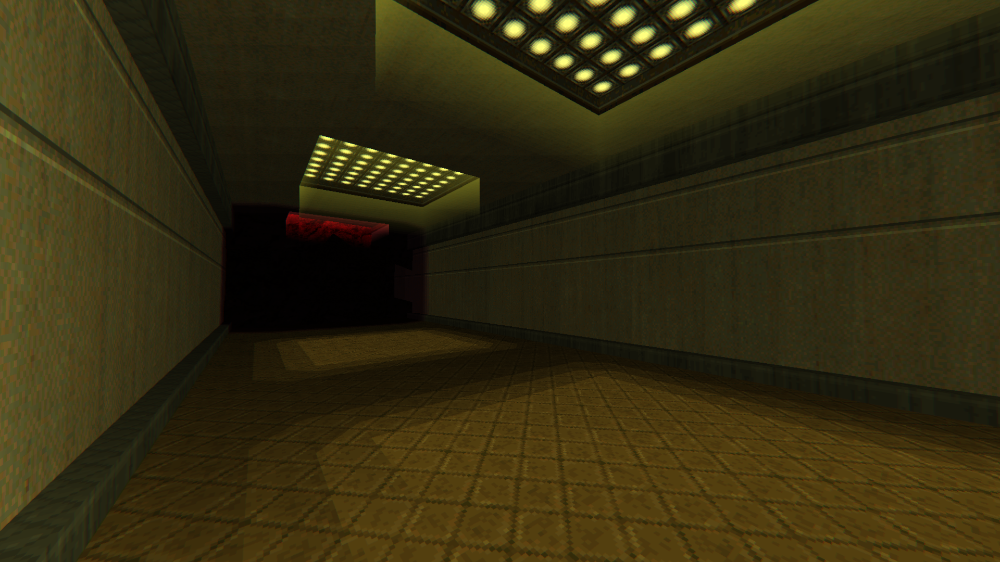
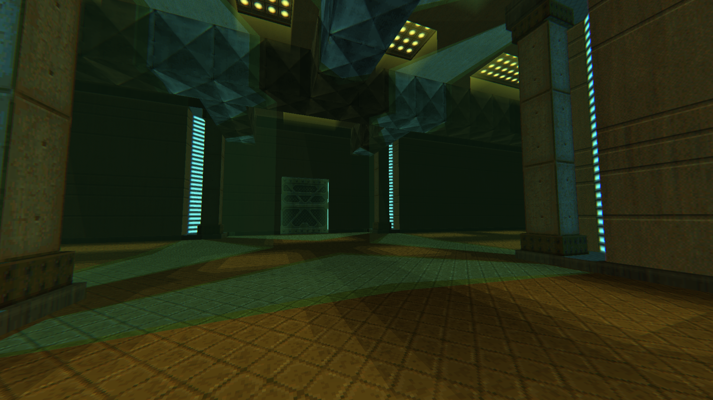
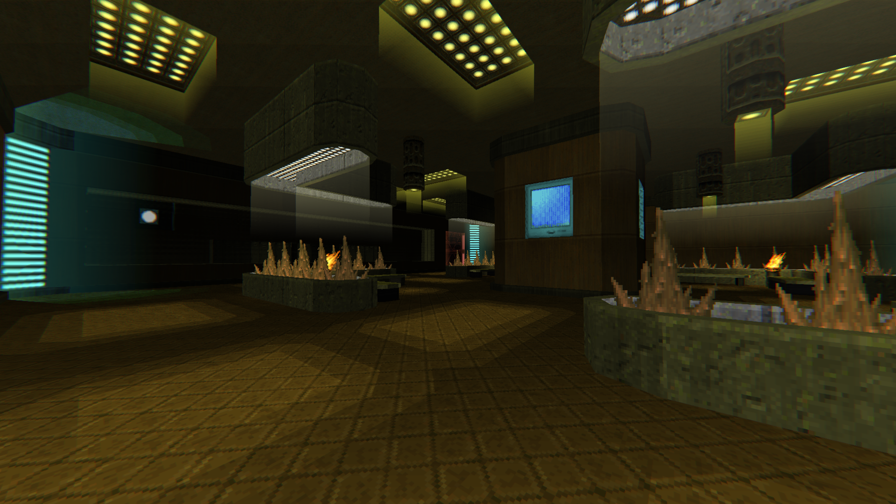

# The Dark Side of Phobos REMAKE [1+ level, GZDOOM-UDMF, DOOM 2]

# STATUS: ⛔CANCELLED

## Resources in use:
- [OTEX_1.1.wad](https://www.doomworld.com/idgames/graphics/otex_1_1)
- [COMTEX.pk3](https://drive.google.com/file/d/1TglQhXCVDBN8fihfPNHD_GiDrz2lowX-/view?usp=sharing)
- [LightingTextures by DRON12261](https://github.com/Doom-Mapping-Modding-Lair-DRON12261/RES-Lighting-Textures)

# Actual screenshots:

